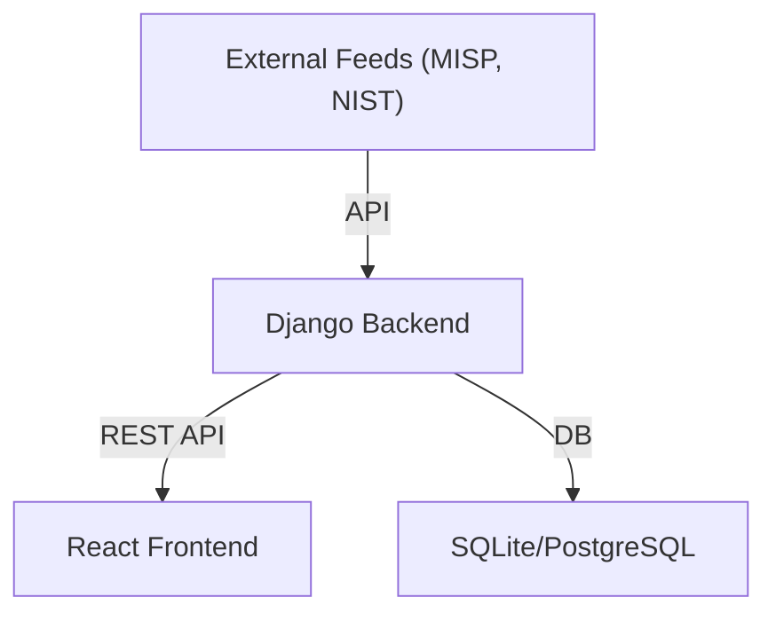
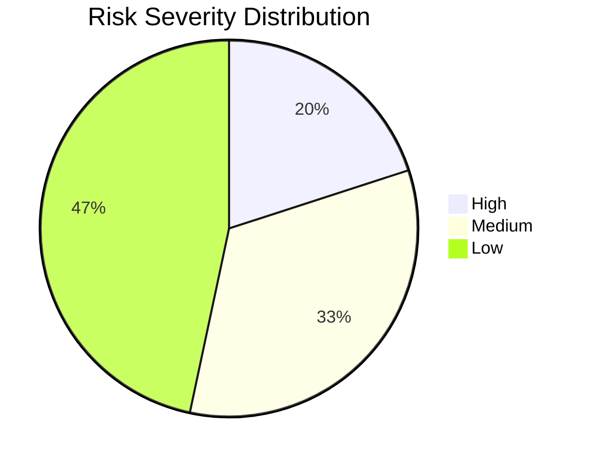
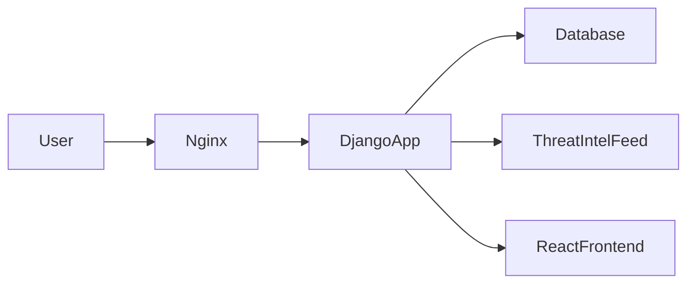

# Platform Development & Integration

This document details the platform development and integration for the HIPAA Checklist Project, including Docker environment setup, feed integration, configuration, analytics dashboards, and deployment documentation.

---

## 1. Docker Environment & Platform Installation

**Overview:**
- The platform is containerized using Docker for consistent deployment across environments.

**Sample Dockerfile:**
```dockerfile
FROM python:3.11-slim
WORKDIR /app
COPY backend/requirements.txt ./
RUN pip install --no-cache-dir -r requirements.txt
COPY backend/ .
CMD ["gunicorn", "hipaa_checklist.wsgi:application", "--bind", "0.0.0.0:8000"]
```

**Installation & Startup:**
1. Build the image: `docker build -t hipaa-checklist .`
2. Run the container: `docker run -d -p 8000:8000 hipaa-checklist`

---

## 2. Feed Integration & Data Flow

**Integrated Feeds:**
- Threat intelligence feeds (MISP, CIRCL)
- Compliance updates (NIST, HIPAA)

**Data Flow Diagram (Mermaid):**


**Evidence:**
- Log: `2025-08-15 10:00:00 - Imported 50 new indicators from MISP.`
- Config: `FEED_API_KEY` set in environment variables

---

## 3. Platform Configuration & Security Customization

**Key Settings:**
- Environment variables for secrets (e.g., `SECRET_KEY`, `FEED_API_KEY`)
- Network segmentation (Docker bridge network)
- HTTPS enforced via reverse proxy (Nginx)
- Custom Django settings for secure session and CSRF

**Documentation:**
- All sensitive configs stored in `.env` (not committed to repo)
- Nginx config enforces TLS and security headers

---

## 4. Analytics Dashboards

**Implemented Dashboards:**
- Risk metrics dashboard (React, MUI): Displays open risks, compliance status, and KPIs
- Compliance report dashboard: Visualizes risk matrix and admin notes

**Example Metrics:**
- Number of open risks by severity
- Compliance status (pass/fail per control)
- Recent alerts and incidents

**Visualization (Mermaid):**


---

## 5. Deployment Documentation

**Deployment Guide:**
1. Clone repository
2. Set up `.env` file with secrets and config
3. Build and run Docker container
4. (Optional) Deploy Nginx reverse proxy for HTTPS
5. Monitor logs and health checks

**Architecture Diagram (Mermaid):**


**Operational Procedures:**
- Daily backups of database
- Weekly dependency updates
- Continuous monitoring via audit logs and alerts

---

## 6. Summary Table

| Component         | Description/Status                                 |
|------------------|----------------------------------------------------|
| Docker           | Configured, documented, used for all deployments   |
| Feed Integration | MISP, NIST, HIPAA feeds, automated import          |
| Config/Security  | Env vars, HTTPS, secure settings, Nginx proxy      |
| Dashboards       | Risk metrics, compliance, visualizations           |
| Deployment Docs  | Step-by-step guide, diagrams, operational details  |

---

**Appendix:**
- Full Dockerfile, docker-compose.yml, and Nginx config available upon request.
