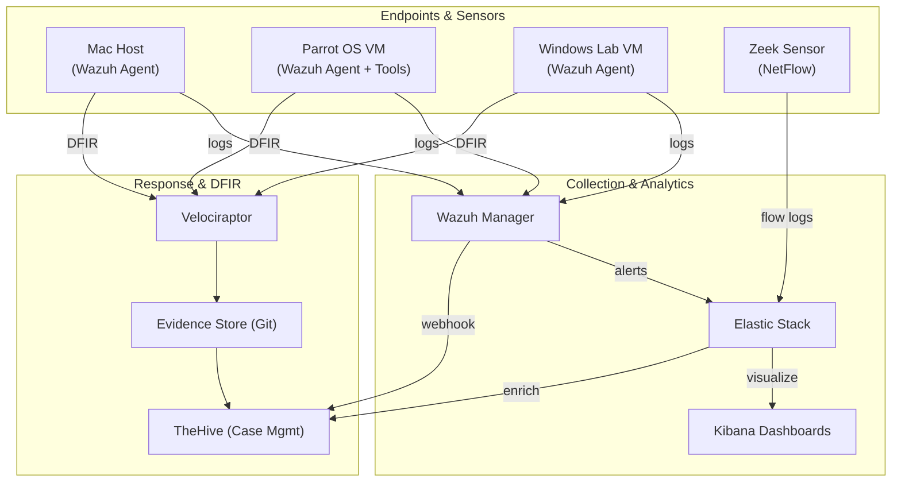

# SOC‑in‑a‑Box

> **A three‑month capstone that bundles all tools, playbooks, labs, and documentation needed to simulate a Tier‑1/2 Security Operations Center.**

---

## 📁 Project Folder Layout

```
SOC-in-a-Box/
├── docs/              # READMEs, design docs, quick‑start
├── scripts/           # Utility scripts (livecap.sh, helpers, etc.)
├── playbooks/         # IR runbooks & SOPs (markdown)
├── dashboards/        # Kibana/Grafana JSON, pcaps, mem images
├── configs/           # Wazuh, Zeek, and ELK rule files
├── investigations/    # Case folders (timeline, artifacts, notes)
├── deliverables/      # Status decks, release zips
└── assets/            # Diagrams & screenshots used in docs
```


---

## 🚀 Quick‑Start (Lab Setup)

1. **Clone the repo & init sub‑modules**
   ```bash
   git clone https://github.com/your‑org/soc‑in‑a‑box.git
   cd soc‑in‑a‑box && git submodule update --init --recursive
   ```
2. **Spin up core VMs** (Parrot OS, Windows Lab) using the supplied Vagrant files in `configs/vagrant/`.
3. **Run the bootstrap script** to install Wazuh Manager + single‑node ELK:
   ```bash
   ./scripts/bootstrap_lab.sh
   ```
4. **Install agents** on each endpoint (`Mac`, `Parrot`, `Windows`) via the helper script in `scripts/agent_install.sh`.
5. **Navigate to Kibana** → `http://<ELK_IP>:5601` and import the starter dashboards from `dashboards/`.
6. **Trigger sample alerts** with `./scripts/generate_test_events.sh` and verify cases appear in TheHive.

> **Need help?** See `docs/quick_start.md` for screenshots of every step.

---

## 🛰️ High‑Level Architecture



*(See **`assets/diagrams/soc_flowchart.png`** for the PNG version.)*

---

## 🔄 Operational Flow

1. **Collection** – Wazuh Agents and Zeek gather host & network telemetry.
2. **Aggregation** – Wazuh Manager parses events; rules escalate to alert level.
3. **Analytics** – Alerts + raw logs are shipped to Elastic → visualized in Kibana.
4. **Ticketing** – Critical alerts auto‑generate cases in TheHive via webhook.
5. **Investigation** – Analysts pull artifacts with Velociraptor; store evidence & notes in `investigations/<case>/`.
6. **Reporting** – Dashboards + playbooks feed weekly status decks located in `deliverables/`.
7. **Continuous Improvement** – Rule tuning & new playbooks are version‑controlled; each weekly tag (e.g., `phase1‑wk2`) captures lab state.

---

## 🗓️ Milestones

| Phase | Date      | Deliverable                                                 |
| ----- | --------- | ----------------------------------------------------------- |
| **1** | Jul 24 ✔︎ | IR‑1 & SM‑1 classes complete; Phase‑1 release zip           |
| **2** | Aug 29    | 67 % of SOC‑in‑a‑Box complete; alert→ticket pipeline proven |
| **3** | Sep 26    | Full project demo & hand‑off documentation                  |

---

## 🤝 Contributing

Pull requests are welcome from teammates—please follow the branch naming convention `feat/<short‑desc>` or `fix/<ticket‑id>` and create a draft PR early for feedback.

---

## 📝 License

This project is licensed under the MIT License—see `LICENSE` for details.

