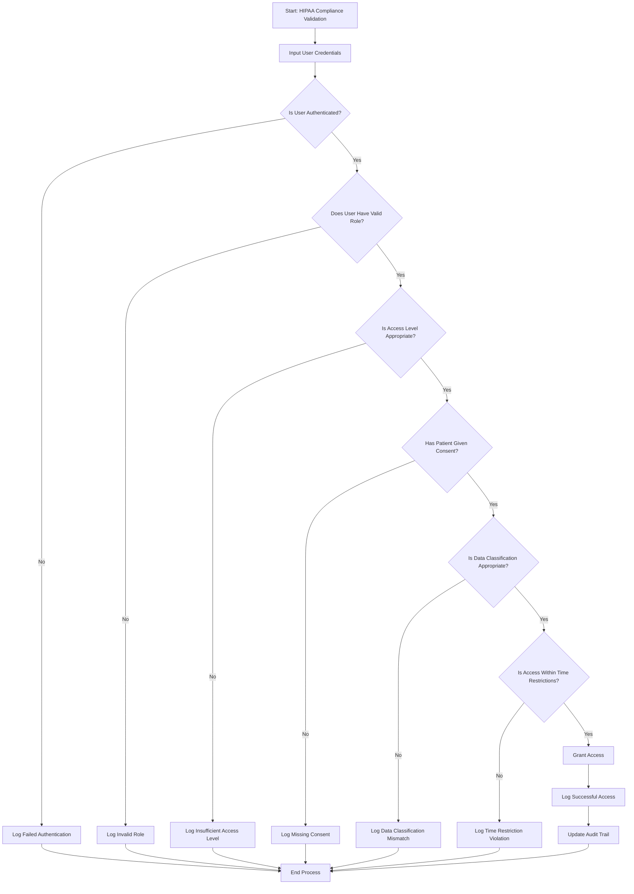

# Logic 1 - Course README

## Course Overview
This course introduces students to fundamental logical thinking and algorithmic problem-solving. Students learn to craft detailed algorithms, create visual flowcharts, and implement Boolean and conditional logic. The course emphasizes systematic problem-solving approaches and visual representation of logical processes.

## Learning Objectives
- Master algorithmic thinking and step-by-step problem solving
- Learn to create detailed flowcharts with proper symbols and structure
- Understand Boolean logic and decision-making processes
- Develop skills in conditional logic and branching
- Apply logical thinking to real-world problems
- Visualize complex processes through flowcharts

## Course Rubric Requirements

### 1. Craft Algorithms
- Numbered algorithm (6+ steps) that seamlessly integrates decision-making using simple Boolean and conditional cues
- Demonstrate systematic problem-solving approach
- Show evidence of logical step progression
- Document algorithm structure and decision points
- Provide examples of algorithm complexity and depth
- Show evidence of clear, actionable steps

### 2. Visualize with Flowcharts
- Detailed flowchart that mirrors the algorithm's structure, including its Boolean and conditional elements
- Use at least five distinct symbols: Start, Stop, and three others
- Demonstrate proper flowchart construction and organization
- Show evidence of visual clarity and logical flow
- Document flowchart symbols and their meanings
- Provide examples of complex flowchart structures

### 3. Incorporate Boolean Logic
- Clear representation of Boolean decision points in the flowchart that align with the algorithm's structure
- Demonstrate understanding of Boolean operations (AND, OR, NOT)
- Show evidence of true/false decision points
- Document Boolean logic implementation
- Provide examples of complex Boolean expressions
- Show evidence of logical consistency

### 4. Apply Conditional Logic
- Representation of 'If' conditions in the flowchart that are consistent with the algorithm's decision structure
- Demonstrate if-then-else conditional structures
- Show evidence of branching and decision paths
- Document conditional logic implementation
- Provide examples of nested conditions
- Show evidence of logical flow control

## Application to HIPAA Checklist Project

### Healthcare Compliance Algorithm
- **Compliance Validation Process**: Step-by-step algorithm for HIPAA compliance checking
- **Risk Assessment Algorithm**: Systematic approach to healthcare risk evaluation
- **User Authentication Process**: Logical flow for healthcare user access control
- **Data Classification Algorithm**: Systematic approach to healthcare data categorization
- **Incident Response Process**: Step-by-step algorithm for healthcare security incidents

### Healthcare Process Flowcharts
- **Compliance Workflow**: Visual representation of HIPAA compliance processes
- **Patient Data Handling**: Flowchart for healthcare data processing and protection
- **Security Incident Response**: Visual flow for healthcare security incident handling
- **Audit Trail Process**: Flowchart for compliance audit and logging procedures
- **User Access Management**: Visual representation of healthcare user permission processes

### Healthcare Boolean Logic
- **Compliance Status**: Boolean logic for HIPAA compliance validation
- **Access Control**: Boolean operations for healthcare user permissions
- **Data Classification**: Boolean logic for healthcare data sensitivity levels
- **Security Alerts**: Boolean conditions for healthcare security notifications
- **Risk Assessment**: Boolean logic for healthcare risk level determination

### Healthcare Conditional Logic
- **Compliance Checking**: If-then-else logic for HIPAA compliance validation
- **User Authentication**: Conditional logic for healthcare user access control
- **Data Processing**: Conditional logic for healthcare data handling
- **Security Monitoring**: Conditional logic for healthcare security alerts
- **Risk Management**: Conditional logic for healthcare risk mitigation

## Key Skills Demonstrated
- Algorithmic thinking and problem solving
- Flowchart creation and visualization
- Boolean logic implementation
- Conditional logic and branching
- Systematic process design
- Visual representation of complex processes

## Evidence of Completion
- Detailed algorithm with 6+ steps and decision points
- Comprehensive flowchart with 5+ distinct symbols
- Clear Boolean logic representation
- Conditional logic implementation
- Logical consistency between algorithm and flowchart
- Professional documentation and presentation

## Technical Stack
- **Flowchart Tools**: Draw.io, Lucidchart, Visio, Miro
- **Algorithm Documentation**: Markdown, LaTeX, Word
- **Boolean Logic**: Truth tables, logical operators
- **Conditional Logic**: If-then-else structures, branching
- **Visualization**: Flowchart symbols, process diagrams
- **Documentation**: Technical writing, process documentation

## Healthcare Compliance Algorithm Example
```markdown
# HIPAA Compliance Validation Algorithm

## Algorithm: Healthcare Data Access Validation

1. **Initialize** - Start the compliance validation process
2. **Input User Credentials** - Receive user ID and authentication token
3. **Validate Authentication** - Check if user credentials are valid
4. **Check User Role** - Determine if user has appropriate role (admin, doctor, nurse, viewer)
5. **Validate Access Level** - Check if user's access level matches requested data
6. **Check Patient Consent** - Verify if patient has given consent for data access
7. **Validate Data Classification** - Check if data sensitivity matches user clearance
8. **Check Time Restrictions** - Verify if access is within allowed time windows
9. **Log Access Request** - Record the access attempt in audit log
10. **Grant or Deny Access** - Provide access if all conditions are met, otherwise deny
11. **Update Audit Trail** - Log the final decision and any actions taken
12. **End Process** - Complete the validation process

## Decision Points:
- Step 3: Is user authenticated? (Boolean: True/False)
- Step 4: Does user have valid role? (Boolean: True/False)
- Step 5: Is access level appropriate? (Boolean: True/False)
- Step 6: Has patient given consent? (Boolean: True/False)
- Step 7: Is data classification appropriate? (Boolean: True/False)
- Step 8: Is access within time restrictions? (Boolean: True/False)
```

## Healthcare Flowchart Example


## Boolean Logic Implementation
```markdown
# Healthcare Compliance Boolean Logic

## Boolean Variables:
- is_authenticated: Boolean (True/False)
- has_valid_role: Boolean (True/False)
- has_appropriate_access: Boolean (True/False)
- patient_consent_given: Boolean (True/False)
- data_classification_appropriate: Boolean (True/False)
- within_time_restrictions: Boolean (True/False)

## Boolean Expressions:
- access_granted = is_authenticated AND has_valid_role AND has_appropriate_access AND patient_consent_given AND data_classification_appropriate AND within_time_restrictions
- security_alert = NOT is_authenticated OR NOT has_valid_role
- audit_required = access_granted OR security_alert
```

## Conditional Logic Implementation
```markdown
# Healthcare Compliance Conditional Logic

## If-Then-Else Structures:

IF user is authenticated THEN
    IF user has valid role THEN
        IF access level is appropriate THEN
            IF patient consent is given THEN
                IF data classification is appropriate THEN
                    IF access is within time restrictions THEN
                        Grant access
                        Log successful access
                    ELSE
                        Deny access
                        Log time restriction violation
                    END IF
                ELSE
                    Deny access
                    Log data classification mismatch
                END IF
            ELSE
                Deny access
                Log missing consent
            END IF
        ELSE
            Deny access
            Log insufficient access level
        END IF
    ELSE
        Deny access
        Log invalid role
    END IF
ELSE
    Deny access
    Log failed authentication
END IF
```

## Flowchart Symbols Used
- **Start/Stop**: Oval shapes for process initiation and termination
- **Process**: Rectangle shapes for data processing steps
- **Decision**: Diamond shapes for Boolean decision points
- **Input/Output**: Parallelogram shapes for data input and output
- **Connector**: Circle shapes for process connections
- **Predefined Process**: Rectangle with double lines for subprocesses

## Healthcare-Specific Applications
- **Patient Data Access**: Logical flow for healthcare data access control
- **Compliance Monitoring**: Algorithmic approach to HIPAA compliance checking
- **Risk Assessment**: Systematic logic for healthcare risk evaluation
- **Incident Response**: Logical flow for healthcare security incident handling
- **Audit Procedures**: Algorithmic approach to compliance auditing

## Learning Outcomes
Upon completion of this course, students will be able to:
- Create detailed algorithms with 6+ steps and decision points
- Design comprehensive flowcharts with proper symbols and structure
- Implement Boolean logic for decision-making processes
- Apply conditional logic for branching and flow control
- Visualize complex processes through flowcharts
- Solve problems using systematic logical approaches

## Healthcare Compliance Integration
The logical thinking implementation specifically addresses healthcare compliance needs:
- **HIPAA Compliance**: Logical processes supporting healthcare regulatory requirements
- **Data Protection**: Systematic approaches to healthcare data security
- **Access Control**: Logical flow for healthcare user permission management
- **Audit Procedures**: Systematic approaches to compliance auditing
- **Risk Management**: Logical processes for healthcare risk assessment

## Advanced Logical Concepts
- **Nested Conditions**: Complex conditional logic for healthcare processes
- **Logical Operators**: AND, OR, NOT operations for healthcare decision making
- **Truth Tables**: Boolean logic validation for healthcare compliance
- **Process Optimization**: Efficient logical flow for healthcare operations
- **Error Handling**: Logical approaches to healthcare error management

---
*This course provides the logical thinking foundation for the HIPAA Checklist Project, ensuring systematic problem-solving approaches for healthcare compliance applications.*
